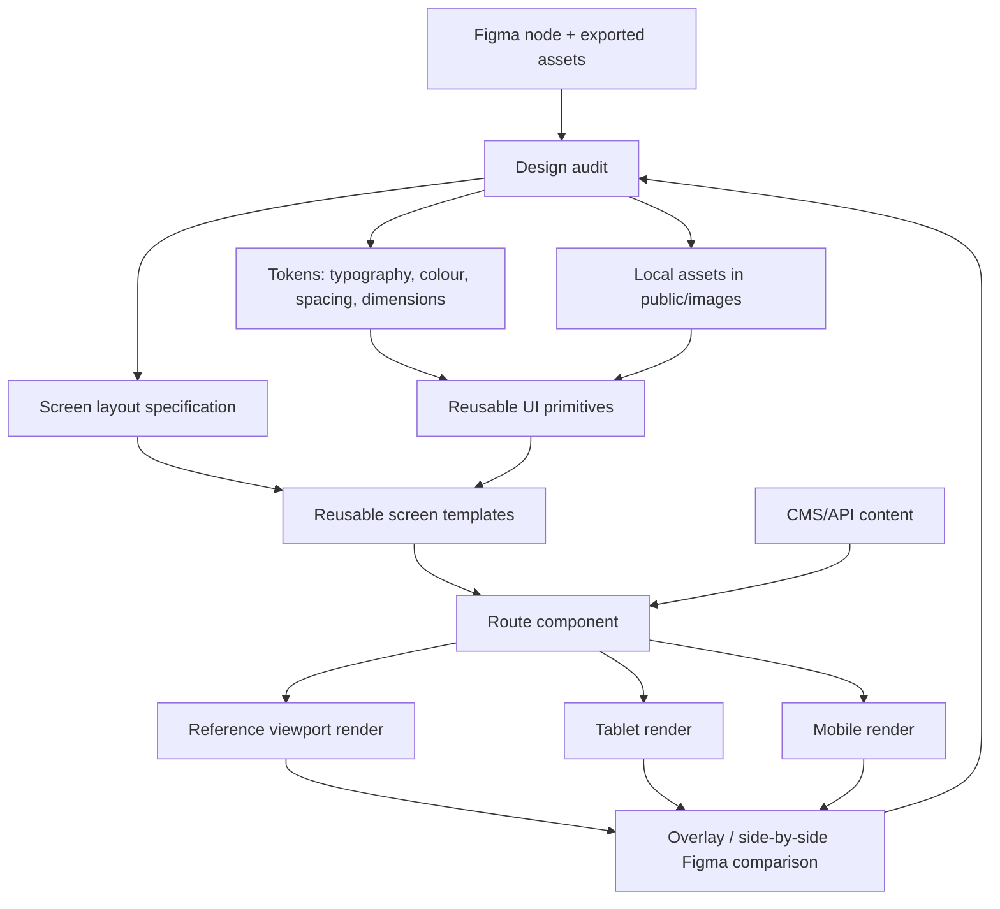

# Design Engineering Guide

This guide is the source of truth for implementing Figma screens in this project with visual fidelity and without duplicating layout logic. It is written for future agents and contributors working through the existing screens one at a time.

## Goal

Every Figma screen should be implemented as a composition of reusable primitives, semantic content, and screen-specific layout data. Do not paste generated Figma code directly into a route. Do not recreate icons or shapes by hand when Figma exports an asset.

The target is not merely a responsive page that looks similar. The target is a browser render that matches the approved Figma node at its reference viewport, then adapts intentionally at smaller breakpoints.

## Design system graph



## Layer model

Build every screen in this order. A correction should normally affect only one layer.

| Layer | Responsibility | Examples |
| --- | --- | --- |
| Foundation | Fonts, colours, global resets, shared breakpoints | `src/app/layout.tsx`, `src/app/globals.css` |
| Assets | Exact exported image, SVG, mask, or illustration bytes | `public/images/<screen>/` |
| Primitives | Small reusable visual blocks | logo lockup, primary nav, angled panel, fact card, chat prompt |
| Templates | Repeated page composition | split-image insight, hero + facts, editorial detail |
| Screen data | Copy, links, asset references, layout variants | API response or typed screen configuration |
| Route | Fetches data and chooses the correct template | `src/app/insights/[slug]/page.tsx` |

## Current insight-screen architecture

The mining insight screen is currently rendered through `Insight1` because its image direction is `left`. The reusable parts should be separated before another insight with a similar visual treatment is built.

```mermaid
flowchart LR
  Route[insights/[slug]/page.tsx] --> InsightTemplate[Insight template]
  InsightTemplate --> Header[InsightHeader]
  InsightTemplate --> VisualPanel[SplitVisualPanel]
  InsightTemplate --> QuotePanel[AngledQuotePanel]
  InsightTemplate --> ArticleCopy[InsightArticleCopy]
  InsightTemplate --> FactsGrid[InsightFactsGrid]
  InsightTemplate --> ChatPrompt[ChatPrompt]

  VisualPanel --> ImageMask[Image + Figma mask]
  VisualPanel --> AccentShape[Exported accent shape]
  FactsGrid --> FactCard[FactCard x4]
```

### Recommended component boundaries

When a second screen needs the same feature, extract it. Do not duplicate markup or copy CSS values.

- `InsightHeader`
  - Logo, menu links, menu bolt.
  - Receives links and active route; owns desktop/mobile navigation alignment.
- `SplitVisualPanel`
  - A background image, optional Figma mask, and optional decorative SVG overlay.
  - Receives positioning data rather than hard-coded screen-specific selectors.
- `AngledQuotePanel`
  - Uses the exported Figma panel SVG as its background.
  - Receives quote text, explicit safe insets, and typography settings.
  - Its opening/closing quote marks must remain inside the panel’s usable polygon, not merely inside its rectangular bounding box.
- `InsightFactsGrid` and `FactCard`
  - Receives icon asset, text, and desktop coordinates/order.
  - Owns responsive grid-to-stack behavior.
- `ChatPrompt`
  - Reuses one field/button treatment across screens.

## Figma implementation workflow

### 1. Start from a node-specific Figma URL

Always request or use a URL with `node-id`. Pull design context before writing code. Record the reference frame size and the key coordinates of the major elements.

### 2. Capture a layout spec before coding

Write down these values from Figma:

| Item | Capture |
| --- | --- |
| Reference frame | Width × height and desktop breakpoint |
| Header | Logo bounds, nav baseline, bolt/menu bounds |
| Main content | Heading, subtitle, body copy x/y/width |
| Visual panel | Image bounds, mask asset, decorative assets, z-order |
| Angled panels | Outer asset bounds, text-safe inset, text width |
| Facts | Icon and label positions, row spacing, column spacing |
| Mobile intent | Reflow, hide, scroll, or stack behavior |

Use the Figma node’s numbers as the desktop source of truth. Do not guess these values from an image alone.

### 3. Save exact assets locally

Figma MCP URLs expire. Download the bytes into an explicit screen folder, for example:

```text
public/images/insight1/figma/
  mining-background.png
  mining-mask.svg
  left-shape-b.svg
  quote-panel.svg
  renewable-energy.png
  automation.png
  mining-3.png
  save-the-world.png
```

Never redraw exported icons with handwritten SVG paths. Use the source asset or a project asset that is visually identical.

### 4. Implement desktop first

For a desktop Figma frame, scale fixed coordinates from the reference width where needed. For example, a 1920px-wide Figma design can use `vw` values for its large, art-directed coordinates, then switch to a reflow layout at a deliberate breakpoint.

Avoid these shortcuts:

- A generic `clip-path` when Figma supplied a mask SVG.
- Flexbox centering when Figma requires an explicit baseline or an absolute offset.
- A text box that only fits a rectangular container when its visible panel is angled.
- A large generic background image that hides or crops the Figma composition.

### 5. Add responsive behavior intentionally

Desktop coordinates are not mobile coordinates. At the breakpoint, reset art-directed positioning and use a semantic reading order.

Recommended behavior for insight pages:

| Viewport | Behavior |
| --- | --- |
| Desktop (`>1200px`) | Figma-aligned art direction and absolute composition |
| Tablet (`901–1200px`) | Reduced type and spacing; preserve two-column information hierarchy where readable |
| Mobile (`≤900px`) | Static/relative flow, image as a short hero, facts stacked or two columns depending on legibility |

When switching a property at a breakpoint, reset all related properties. For example, changing an absolutely positioned visual panel to mobile flow should also reset `top`, `left`, `right`, `width`, masks, and text alignment if they no longer apply.

## Visual correction loop

Use this loop for every screen. Fix the largest structural mismatch first.

1. Render the exact route at Figma’s reference viewport.
2. Compare side by side with the Figma screenshot.
3. Check layers in this order:
   1. frame size and crop;
   2. background mask/shape and z-order;
   3. header baseline and horizontal bounds;
   4. primary heading position and line breaks;
   5. panels and their text-safe areas;
   6. facts/icons and labels;
   7. small decoration and shadows.
4. Change one layer at a time.
5. Render desktop, tablet, and mobile again.
6. Type-check after every meaningful edit.

### Required comparison checklist

- Does the image use the Figma mask rather than an approximation?
- Do decorative SVGs sit above/below the correct layer?
- Is the logo center aligned with the menu-link baseline, not merely the menu container?
- Does text remain inside the visible polygon of an angled panel?
- Are text line breaks equal to the Figma reference at desktop width?
- Are icon dimensions explicit and consistent with Figma?
- Does mobile reflow without overlap, clipping, or a fixed element covering content?
- Are the route and type check working after the change?

## Common failure modes and fixes

| Symptom | Likely cause | Correct fix |
| --- | --- | --- |
| Background diagonal points in the wrong direction | Generic `clip-path` replaced a Figma mask | Use the exported mask SVG with `mask-image` / `-webkit-mask-image` |
| Photo is too washed out or too vivid | Mask alpha and overlay opacity are not both accounted for | Use the Figma mask plus its matching overlay/accent asset; tune only after comparing |
| Logo and menu look misaligned | Links are flex-centered against a tall icon | Position the nav container from the Figma icon bounds, then measure the link baseline |
| Quote mark crosses the angled border | Padding is based on the box rectangle, not the polygon | Set a left safe inset based on the border position at the text’s y-coordinate |
| Quote text reaches the pointed edge | Missing right text-safe inset | Give the text column an explicit max width/right inset |
| Similar screens drift apart | Each screen has local copied CSS | Extract the shared primitive and pass layout data/variants |
| A mobile fix breaks desktop | Same selectors mix art direction and reflow | Keep desktop values in the base style and fully reset them in the mobile media query |

## Definition of done for a screen

A Figma screen is complete only when all of the following are true:

- Exact Figma assets are stored locally or sourced from a durable CMS/CDN.
- The desktop reference viewport matches Figma in structure, line breaks, major coordinates, masks, and icon sizing.
- Tablet and mobile have deliberate layouts with no overlap or clipped content.
- Repeated elements have been reused or extracted; no copied screen-wide CSS is introduced without a documented reason.
- `npx tsc --noEmit` passes.
- A screenshot has been reviewed at the reference desktop width and at least one mobile width.

## Practical commands

```bash
# Start the development server
npm run dev

# Type check
npx tsc --noEmit

# Capture a reference viewport after the server is running
npx playwright screenshot \
  --browser=chromium \
  --viewport-size='1920,980' \
  --wait-for-timeout=2500 \
  http://127.0.0.1:5005/insights/solar-mining \
  /tmp/insight-desktop.png
```

Keep this document updated when a new shared primitive, breakpoint rule, or reliable correction technique is introduced.


these are feedbacks from my client 

	General Points	 Bug-0001	All pages need to recheck  the designs and alignments 
		 Bug-0002	Let's Energy chat box prompt Opacity need to increase
		 Bug-0003	All page form designs need to shape the base slanting designs 
		 Bug-0004	Page heading typography and color variations need to check
		 Bug-0005	All pages text need to check typography and aligments
		 Bug-0006	Landing Page - When clicking on the title highlight, it is navigating to other screen, but screen is not loading
	Top Menu		
1	Homepage	 Bug-0007	Need to align the sliders properly, the heading of the slider need to give the link of purticular pages
		 Bug-0008	In responsiveness, the height in issue has a white space in the bottom
		 Bug-0009	Home slideranimation not working
2	Explore (About Us)	 Bug-0010	Leftside text need to aligh in the box
3	Energy	 Bug-0011	Right side menu need align correctly based on design
		 Bug-0012	Neet to check Left side Heading text typography
4	Elements	 Bug-0013	The left top below the cateogory like GREEN Sunshine,GREEN Sunsmart need to change in onclick
		 Bug-0014	Elements and the rightside content not working proply , and also need to check align.
		 Bug-0015	Right side baclground images and specs need to change base on products 
5	"
Expertise"	 Bug-0016	Grid - Not Showing the all soluction cards and links, left side explore button need to align
		 Bug-0017	Slider - the slider needs to scroll front and back, not a simple default animation.
		 Bug-0018	Please check the the Figma design , in this page left dont have any solution card links
6	Enlist	 Bug-0019	Need to check typography and aligments
7	Engage	 Bug-0020	Enquiry Link button need to postion correctly
	Side Menu		
	EXPLORE		
8	Welcome to Green	 Bug-0021	Leftside text need to aligh in the box
9	Why GREEN?	 Bug-0022	Need to check typography and aligments, Header fontsize need to increase, Icon sizes also need to increase
10	Global Snapshot 	 Bug-0023	Need to check typography and aligments,bottom content need to align in right side based on design
11	Fast Facts & Stats	 Bug-0024	The slider over box needs to shape correctly. , Bottom box and content need to align,Need to check header typography and alignments
	EVOLUTION		
12	Our Story & Milestones 	 Bug-0025	Right side Milestone image need to fix correcly , it streched
13	Mission & Vision	 Bug-0026	Need to check box content  typography and aligments and the icons need to big based on design, left side background image nedd to align properly
14	Leadership Team 	 Bug-0027	Leftside slider text font size need to increase
15	Certifications & Accreditations 	 Bug-0028	Left-side slider text and background images need to align based on design
16	Sustainability & ESG Commitments	 Bug-0029	The page design not matchning need to chnage the design based on original designs
	ENGINEERING		
17	Solar EPCM Services 	 Bug-0030	Rightside background images need to align right side, not center
18	Hybrid & Microgrid Solutions 	 Bug-0031	Need to check typography and aligments, CTA buttons need to align rightside
19	Energy Storage & Smart Grid 	 Bug-0032	Need to check typography and aligments, 
20	O&M & Monitoring 	 Bug-0033	Right side content not available need to add and need to check typography and aligments
	GRID-INTEL 	 Bug-0034	Right side menu text need to alighn based on designs
21		 Bug-0035	The Popup shape needs to change and remove the borders
22	Products & Systems 	 Bug-0036	Page not have the submenu product links and page designs, Need to add Sun product links, Check Figma Base designs
	ENDEAVORS		
	Project Portfolio 	 Bug-0037	The designs and shapes need align based on the Figma base designs
23		 Bug-0038	Project sliders are align properly, Project overlap color need to reduce th opacity,
24	Flagship Projects 	 Bug-0039	Alignment are missing and also need to check the typography
25	Case Studies 	 Bug-0040	(Feature Designs)
26	Community Energy Stories	 Bug-0041	(Feature Designs)
	ENLIGHTEN		
27	Insights & Articles	 Bug-0042	Need to check typography and aligments , To add multiple cards and also check 
28	Reports & Whitepapers 	 Bug-0043	Need to check typography and aligments , To add multiple cards and also check 
29	Events & Webinars 	 Bug-0044	"Card size need to reduce and also check typography and aligments , 
To add multiple cards and also check "
30	Thought Leadership 	 Bug-0045	Need to check typography and aligments , To add multiple cards and also check 
31	Media & Mentions	 Bug-0046	Need to check typography and aligments , To add multiple cards and also check 
32	Learning Hub	 Bug-0047	(Feature Designs)
	ECOSYSTEM		
33	Our Value Chain    	 Bug-0048	Need to aligh th background image and also check typography and aligments 
34	"Supply Partners ›
Supplier Code of Conduct / Handbook"	 Bug-0049	Supply partner registeration form button colorcode need to upade in standards
35	"Our Procurement Philosophy
"	 Bug-0050	No Link - design available in Figma
36	Key Supply Categories	 Bug-0051	No Link - design available in Figma
37	Become a Supplier	 Bug-0052	No Link - design available in Figma
38	Client Partners › 	 Bug-0053	The right side background image needs to align
39	Collaboration and innovation	 Bug-0054	No Link - design available in Figma
40	Industry Affiliations & Certifications 	 Bug-0055	Rightside banner over text need to align and also check the typography and alignments
41	Community Impact Loop	 Bug-0056	Rightside menu content need to align properly , content alignment varying each menu
42	Technology & Innovation Alliances	 Bug-0057	right-side background image  are not shown correcly, based on the designs
43	Impact Measurement & ESG	 Bug-0058	Right-side slider images are not shown correcly, the CTA button need to move top and also need to check typography and alignments
	EMPOWER		
43	"Team GREEN
"	 Bug-0059	Need to check typography and alignments, Need to Check rightside content alignment content overlaps the center images
44	Careers at GREEN	 Bug-0060	"Popup shape need to align and remove spaces in popup and also need to check typography 
and alignments"
45	GREEN Talent Incubator	 Bug-0061	Menu-Right side text need to aligh correctly and need to check typography and aligments
46	Women in Energy	 Bug-0062	Need to check typography and alignments, Meet our team Popup -leftside menu needs to add
43	Community Voices	 Bug-0063	Need to check typography and alignments right side cards need to align vertical
	ENGAGE		
44	Partner With Us 	 Bug-0064	Need to give standard color pattern for the CTA buttons, Need to check typography and alignments
45	Become a Supplier 	 Bug-0065	Need to give standard color pattern for the CTA buttons, Need to check typography and alignments
46	Investor Relations 	 Bug-0066	"Right-side slider images need to move top, the CTA button need to move top and also need to check
typography and alignments, Need to check the base designs "
43	Public Events & Volunteering 	 Bug-0067	Need to check typography and alignments right side cards need to align vertical
44	Contact Us 	 Bug-0068	Need to check the Figma design, need the popup form for this
45	Book a Consultation 	 Bug-0069	Need to check typography and alignments
46	Request a Proposal (RFP) 	 Bug-0070	Need to check typography and alignments
47	Media & Press 	 Bug-0071	Right-side slider images need toalign correctly, Popup shapes need to align, and also need to check typography 
48	Newsletter Signup 	 Bug-0072	Need to check typography and alignments
49	Find Us Globally (Map)	 Bug-0073	The map size needs to increase and the left side cards need to be positioned with correct alignment